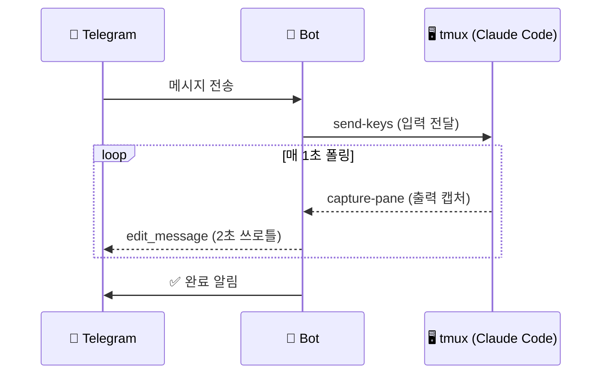

<div align="center">

# claude-telegram

[](https://opensource.org/licenses/MIT)
[](https://www.python.org/)
[](https://core.telegram.org/bots)
[](https://claude.ai)

**텔레그램에서 Claude Code를 실시간으로 제어하는 봇**

메시지 하나로 Claude가 코드를 작성하고, 도구를 실행하고, 결과를 돌려주는 과정을<br/>
텔레그램에서 실시간으로 확인하세요.

</div>

<br/>

## 작동 방식



tmux 위에서 돌아가는 Claude Code 세션에 직접 연결합니다. SDK나 API 래퍼 없이, `send-keys`로 입력하고 `capture-pane`으로 출력을 읽어오는 단순한 구조입니다.

## 주요 기능

| | 기능 | 설명 |
|:---:|------|------|
| **⚡** | **실시간 스트리밍** | `Bash(...)`, `Read(...)` 등 도구 실행 과정을 텔레그램에서 실시간 확인 |
| **🔄** | **자동 세션 감지** | Claude Code hook으로 세션 시작/종료 자동 감지 + 텔레그램 알림 |
| **📂** | **다중 프로젝트** | `/projects`로 번호 목록 확인, `/1` `/2`로 즉시 전환 |
| **🔔** | **완료 알림** | 작업 중 편집은 무음, 완료 시 알림음과 함께 새 메시지 전송 |
| **🛡️** | **자동 복구** | circuit breaker 워치독 (5회 크래시/60초 감지 시 자동 재시작) |

## 명령어

| 명령어 | 설명 |
|--------|------|
| `/projects` | 프로젝트 목록 (● 활성 ○ 비활성) |
| `/1`, `/2`, ... | 번호로 프로젝트 전환 |
| `/project <이름>` | 이름으로 프로젝트 전환 |
| `/new` | 새 대화 시작 |
| `/stop` | Ctrl+C — 작업 중단 |
| `/esc` | Escape 전송 |
| `/yes` | 권한 승인 (y + Enter) |
| `/status` | 세션 상태 확인 |

## 빠른 시작

```bash
git clone https://github.com/ms2116/claude-telegram.git
cd claude-telegram
uv sync
cp .env.example .env   # 토큰, 유저 ID, 프로젝트 경로 설정
uv run claude-telegram
```

## 설정

`.env` 파일에서 `CT_` 접두사로 설정합니다.

| 변수 | 필수 | 설명 |
|------|:----:|------|
| `CT_TELEGRAM_BOT_TOKEN` | ✅ | [@BotFather](https://t.me/BotFather)에서 발급받은 토큰 |
| `CT_PROJECT_DIRS` | ✅ | 프로젝트 디렉토리 (쉼표 구분) |
| `CT_ALLOWED_USERS` | | 허용할 텔레그램 유저 ID (쉼표 구분) |
| `CT_PERMISSION_MODE` | | `acceptEdits` / `default` / `bypassPermissions` |
| `CT_MODEL` | | Claude 모델 지정 |
| `CT_MAX_TURNS` | | 쿼리당 최대 턴 (0 = 무제한) |

## 자동 세션 관리

`~/.claude/settings.json`에 hook을 등록하면, Claude Code 세션이 시작/종료될 때 봇이 자동으로 감지합니다.

```json
{
  "hooks": {
    "SessionStart": [{
      "matcher": "",
      "hooks": [{"type": "command", "command": "bash /path/to/register-session.sh"}]
    }],
    "SessionEnd": [{
      "matcher": "",
      "hooks": [{"type": "command", "command": "bash /path/to/unregister-session.sh"}]
    }]
  }
}
```

> [!IMPORTANT]
> `settings.local.json`이 아닌 **`settings.json`** 에 등록해야 합니다.<br/>
> `"matcher": ""`와 `bash` 명시가 필수입니다.

**동작 흐름**: hook이 `/tmp/claude_sessions/`에 세션 파일 생성 → 봇의 백그라운드 감시자(30초 주기)가 감지 → 텔레그램 알림 전송

## 프로덕션

```bash
bash run.sh   # PID 잠금 + circuit breaker + 자동 재시작
```

## 구조

```
src/claude_telegram/
├── config.py    # 환경변수 (pydantic-settings, CT_ prefix)
├── claude.py    # TmuxSession + ClaudeManager
├── bot.py       # 텔레그램 핸들러, 스트리밍
├── store.py     # SQLite 세션 로깅
└── main.py      # 엔트리포인트, 기동 알림
```

5개 파일, ~800줄. 과잉 설계 없음.

## 라이선스

MIT
